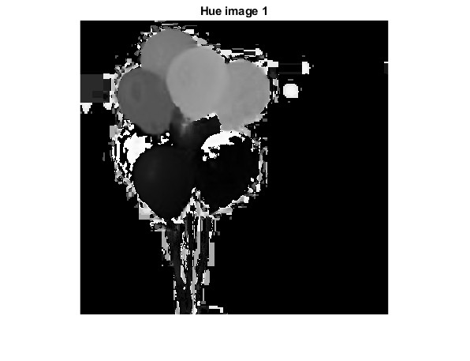
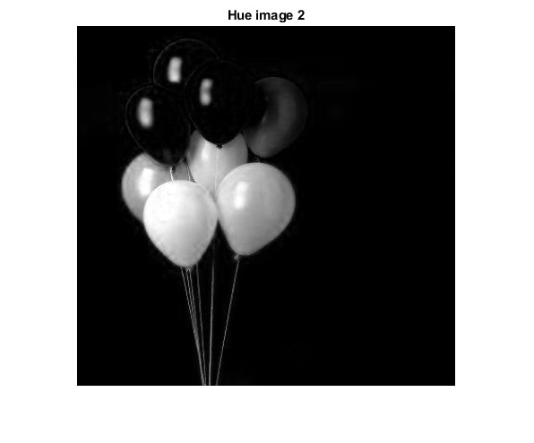
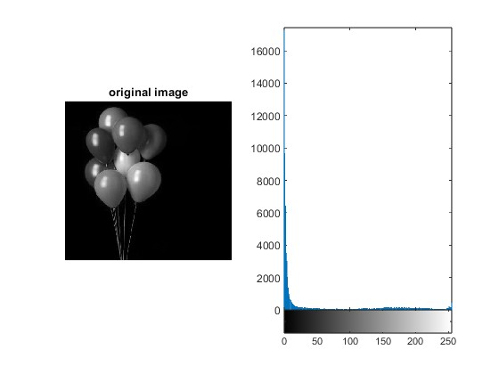

# Color Segmentation
This project investigates several colour segmentation approaches in MATLAB, with a particular focus on RGB colour space thresholding and hue-based segmentation in the HSI (Hue, Saturation, Intensity) or HSV (Hue, Saturation, Value) colour spaces. We want to examine the efficacy of several strategies for segmenting objects in photos based on colour.


## Problem Description
In this project, we address the challenge of segmenting objects in images based on their color. The primary objectives are as follows:

    1. Using intensity-based thresholding to segment the image.
    2. Converting the image to grayscale by averaging the RGB channels.
    3. Applying RGB channel thresholds to isolate objects.
    4. Segmenting based on the hue component in HSI/HSV color space.
    5. Comparing and selecting the most effective segmentation method.
This project showcases the versatility of color segmentation techniques


## Solution
In this section, we present the solution to the challenge of color segmentation. The provided MATLAB code showcases a practical implementation of these segmentation techniques on an image. The code is modular and includes functions for image processing, thresholding, and conversions between color spaces. Let's break down the solution into key components:

#### Image Processing Functions
We begin by reading the input image and converting it into a double format for further manipulation. The image is then converted into grayscale, where the average of the red, green, and blue channels is calculated, resulting in the variable k1.
```matlab
% Read the image
k = imread("image.jpg");

% Convert the image into a double format
k = double(k);

% Calculate the average of R, G, and B channels
k1 = (k(:,:,1) + k(:,:,2) + k(:,:,3)) / 3;

```

#### Thresholding Methods
We demonstrate the power of thresholding in segmentation by using two distinct methods: intensity-based thresholding and RGB color channel thresholding.

1. Intensity-Based Thresholding
The grayscale image, my_image, is thresholded using logical indexing. Pixels with intensity values above a certain threshold are set to 256, while those below another threshold are set to 0.

```matlab
% Perform thresholding by logical indexing (Trial and error)
image_thresholded = my_image;
image_thresholded(my_image > 3) = 256;
image_thresholded(my_image < 0.5) = 0;
```
2. RGB Color Channel Thresholding
The code calculates a 16-bin histogram for the original image and computes a global threshold using Otsu's method. This threshold is applied to the grayscale version of the image, resulting in a binary image that emphasizes the segmented regions.

```matlab
% Calculate a 16-bin histogram for the image
[counts, x] = imhist(k, 16);

% Compute a global threshold using the histogram counts
T = otsuthresh(counts);

% Create a binary image using the computed threshold and display the image
BW = imbinarize(k1, T);
imshow(BW)
title('Thresholded Image 2')

```


#### Color Space Conversions
To demonstrate an alternative approach, we convert the original RGB image to the HSV (Hue, Saturation, Value) color space. We visualize the hue component, H, as an image. The code also showcases the conversion of the image back to the RGB color space.
```matlab
% Convert the RGB image to HSV color space
A = imread('image.jpg');
B = rgb2hsv(A);

% Converting the image to HSV space
imhist(A(:,:,1));
figure;
imshow(B(:,:,1));
title('Hue Image 1')

A = hsv2rgb(B);
figure;
imshow(A(:,:,1));
title('Hue Image 2')

```
These snippets illustrate the flexibility and applicability of various color segmentation techniques, providing practical insights into their usage. The code is designed for adaptability and can be customized for different scenarios and image data.

## Function Used
* imread(): Reads an image for processing.
* imshow(): Displays images.
* imhist(): Calculates image histograms.
* imbinarize(): Converts images to binary based on a threshold.
* rgb2hsv(): Converts RGB images to HSV color space.
* hsv2rgb(): Converts HSV images back to RGB.
* title(): Adds titles to displayed images.e.


## Input Images
* Original RGB image.
  


## Output Images
* Image Segmentation (HSV method):
  


* HSV2RGB image:
  


* Histogram:
  



## Conclusion
In conclusion, this project highlights the significance of color segmentation in computer vision. It demonstrates how different color spaces and thresholding methods can be used to extract objects from images. Notably, segmenting based on the hue in the HSV color space can be more precise, especially when dealing with objects of various colors. The choice of segmentation technique depends on the specific requirements of the task.

###if you like what i do, maybe consider buying me a coffee/tea 🥺👉👈
<a href="https://www.buymeacoffee.com/techs4shubq" target="_blank"></a>

## Authors

- [@Shubham Singh](https://github.com/Shubham722-227)


## License

[](https://choosealicense.com/licenses/mit/)

